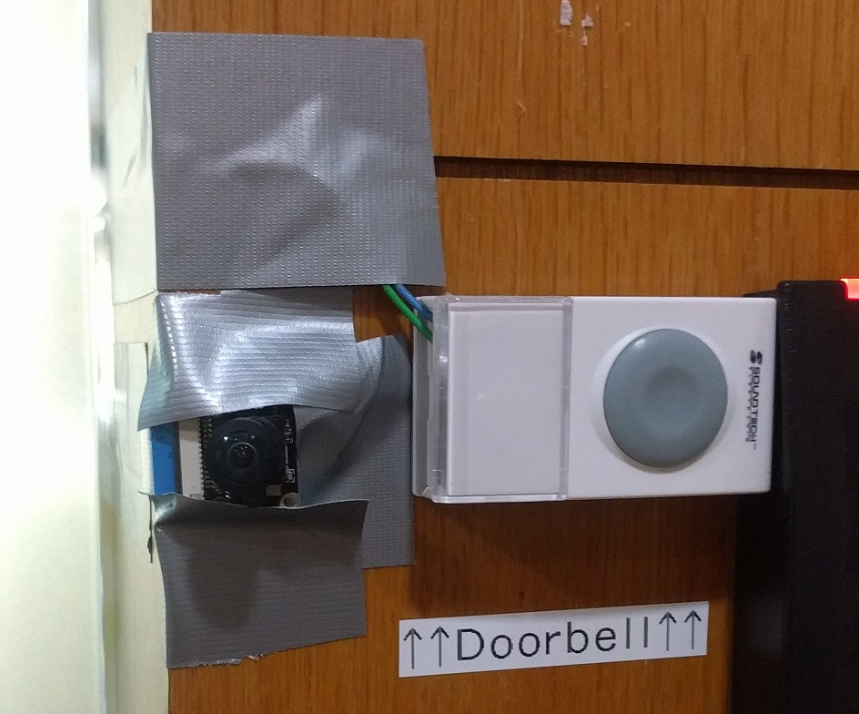
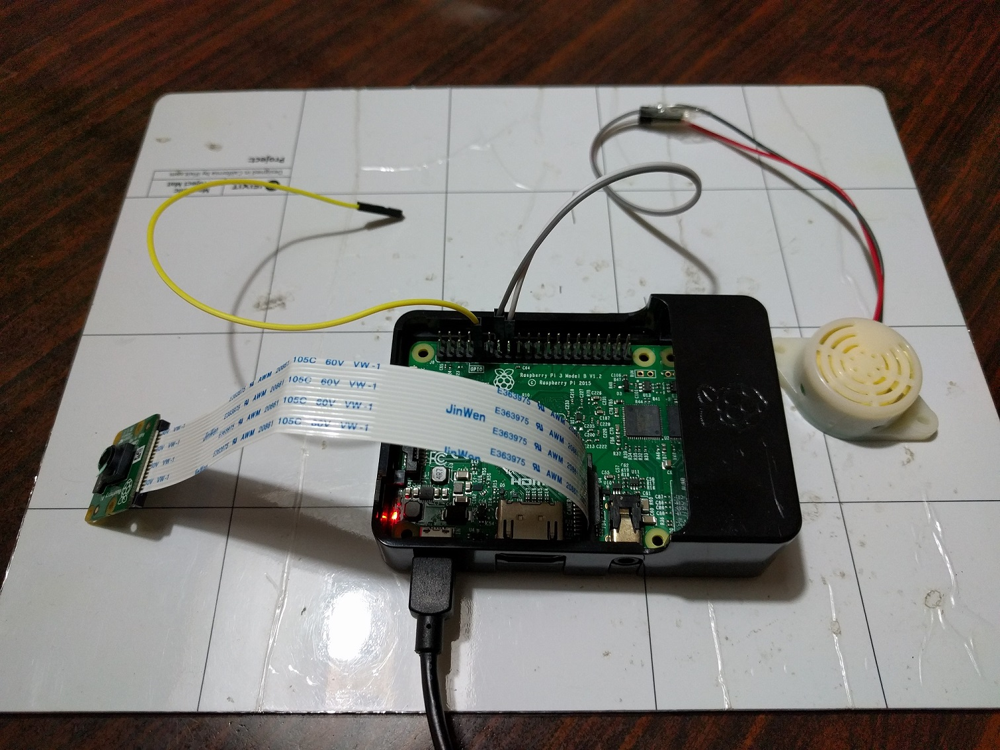

# SP IoT doorbell

An IoT doorbell at Singapore Power's Digital Tech office that will take a picture of a visitor and notify a Slack channel when the button pressed. The operating system used is Arch Linux ARM and the code is in Python 3.

## Pictures and Demo video


This is the set that is actually deployed with a proper button and wide-angle camera.


The camera and button are placed in line to make sure they are associated to be together. Button is modified from an actual doorbell.


The camera and button are connected to a Raspberry Pi at the back.


This is used for testing purposes before moving the SD card image to the deployed set. The button is simulated by shorting the pins. Camera is the official [8MP camera board v2](https://sg.element14.com/raspberry-pi/rpi-8mp-camera-board/raspberry-pi-camera-board-v2/dp/2510728).

[](http://www.youtube.com/watch?v=MGRNmj3iRuI)

## Behaviour workflow

1. On bootup, the `iot-doorbell.service` in started which in turn launches the `iot-doorbell-startup.sh` shell script. The shell script starts the `bell-camera.py` python code.
2. One beep is output to indicate that the program is started.
3. The program will test connectivity to `http://slack.com` by repeatedly hitting it at a rate of 1 attempt/second beeping each time it does so.
4. If 20 failed attempts has been made, the program will stop trying and output only 1 beep to indicate the failure. It will then continue in just a dumb doorbell mode. If connection is achieved later, the pictures will also be sent.
5. If connectivity to Slack is successful, the program will output 2 beeps and send a boot success message to Slack.
6. Whenever the button is pressed, the program will start a thread to send one text-only message first so the Slack channel can be alerted quickly. The image is then taken and uploaded in a second message which will take slightly longer.
7. I have set the minimum interval between messages sending to be 10 seconds to prevent channel flooding from continuous pressing. The bell however will continue to ring as long as the button is pressed.

## Schematic


A Fritzing drawing indicating the connection between the components to the Raspberry Pi 3. The picture depicted is that of the first Pi B+ which has the exact same pinout as the Pi 3 for the first few pins.

A wide-angle camera is connected to the CSI connector.

## Parts required
1. Raspberry Pi 3
2. 8GB or larger SD card
3. [Piezo Buzzer 3-20VDC Continuous Tone](http://www.sgbotic.com/index.php?dispatch=products.view&product_id=1926)
4. [Raspberry Pi Wide Angle Camera Module](https://www.seeedstudio.com/Raspberry-Pi-Wide-Angle-Camera-Module-p-2774.html)
5. [70cm Camera Flex cable](http://www.sgbotic.com/index.php?dispatch=products.view&product_id=2258)
6. [Raspberry Pi clear case](http://sg.element14.com/multicomp/83-17540/enclosure-raspberry-pi-3-2-b-clear/dp/2674868)
7. 2A USB Power Adapter
8. microUSB cable for power
9. Some random doorbell button
10. USB-TTL cable for configuration

## Setting up the Raspberry Pi from scratch

1) Set up the Arch Linux ARM on an SD card by following the [official instructions](https://archlinuxarm.org/platforms/armv8/broadcom/raspberry-pi-3).

2) Before removing the SD card from the computer, access the `boot` partition. Open `config.txt`. Add the following into the file. First 3 lines enable the camera. Last line enables the console over the UART pins.

```
gpu_mem=128
start_file=start_x.elf
fixup_file=fixup_x.dat
enable_uart=1
```
3) Power on the RPi and convert the file system to read-only if needed by following my [gist](https://gist.github.com/yeokm1/8b0ffc03e622ce011010). You don't have to enable root over SSH as we will disable SSH at the end of this anyway.

4) Connect an Ethernet cable with internet connection. Enter the root account via the USB-UART and run the following commands

```bash
#Install all dependencies
pacman -Syu python python-pip wget base-devel yajl git cronie
pip install requests

#Let alarm user control gpio pins without being root
groupadd -f -r gpio
usermod -G gpio alarm
vi /etc/udev/rules.d/99-gpio.rules

#Add the following to the 99-gpio-rules file
SUBSYSTEM=="bcm2835-gpiomem", KERNEL=="gpiomem", GROUP="gpio", MODE="0660"
SUBSYSTEM=="gpio", KERNEL=="gpiochip*", ACTION=="add", PROGRAM="/bin/sh -c 'chown root:gpio /sys/class/gpio/export /sys/class/gpio/unexport ; chmod 220 /sys/class/gpio/export /sys/class/gpio/unexport'"
SUBSYSTEM=="gpio", KERNEL=="gpio*", ACTION=="add", PROGRAM="/bin/sh -c 'chown root:gpio /sys%p/active_low /sys%p/direction /sys%p/edge /sys%p/value ; chmod 660 /sys%p/active_low /sys%p/direction /sys%p/edge /sys%p/value'"
#end of adding
```
5) Switch over to the alarm user. This user account will be used to run non-privileged stuff including the python program.

```bash
su alarm
cd ~
mkdir iot-doorbell
cd iot-doorbell
#Place the files bell-camera.py, iot-doorbell.service and iot-doorbell-startup.sh into this folder

#You can run these SCP commands on your host machine. Replace x.x.x.x with the IP address of the RPi.
#scp bell-camera.py alarm@x.x.x.x:/home/alarm/iot-doorbell
#scp iot-doorbell.service alarm@x.x.x.x:/home/alarm/iot-doorbell
#scp iot-doorbell-startup.sh alarm@x.x.x.x:/home/alarm/iot-doorbell

#chmod in case you transfer the file in without executable permissions
chmod +x iot-doorbell-startup.sh
su -c "cp iot-doorbell.service /etc/systemd/system/"

#Install yaourt so as to prepare to install the GPIO package from AUR
cd ~
git clone https://aur.archlinux.org/package-query.git
cd package-query
makepkg -s
su -c "pacman -U package-query-1.8-2-armv7h.pkg.tar.xz"

cd ..

git clone https://aur.archlinux.org/yaourt.git
cd yaourt
makepkg -s
su -c "pacman -U yaourt-1.8.1-1-any.pkg.tar.xz"

yaourt -S python-raspberry-gpio

#1. Enter "1" to install the only package if asked
#2. Give alarm (default "alarm") and root password (default "root") when asked
#3. Do NOT edit PKGBUILD or anything else when they say "Unsupported Package" or similar warnings. Press "N".
#4. Answer Yes to install any requested dependencies or building

#Clear command history
history -cw
exit
```

6) You should be back to the root account.

```bash
#Restart the device every Monday at 0700
crontab -e
00 7   *   *   1    /usr/bin/reboot
systemctl enable cronie.service

#Enable the service so the program will start on boot
systemctl enable iot-doorbell.service

#Disable SSH for security reasons
systemctl disable sshd
```

7) Configure Wifi settings (Optional)

```bash
cp /etc/netctl/examples/wireless-wpa /etc/netctl/.
nano /etc/netctl/wireless-wpa
#Adjust settings to match your network

#This is to test your profile. If you are not using SSH, you should unplug the Ethernet cable now to test.
netctl start wireless-wpa
#Take effect on every boot
netctl enable wireless-wpa
```

8) Change default user passwords

```bash
passwd root

passwd alarm
```

9) Clear command history and reboot

```bash
#Clear command history
history -cw

reboot
```

## References

1. [Check server availability in Python](http://stackoverflow.com/questions/3764291/checking-network-connection)
2. [Post requests in Python](http://stackoverflow.com/questions/37283111/cannot-post-images-to-slack-channel-via-web-hooks-utilizing-python-requests)
3. [Use GPIO without being root](https://arcanesciencelab.wordpress.com/2016/03/31/running-rpi3-applications-that-use-gpio-without-being-root/)
